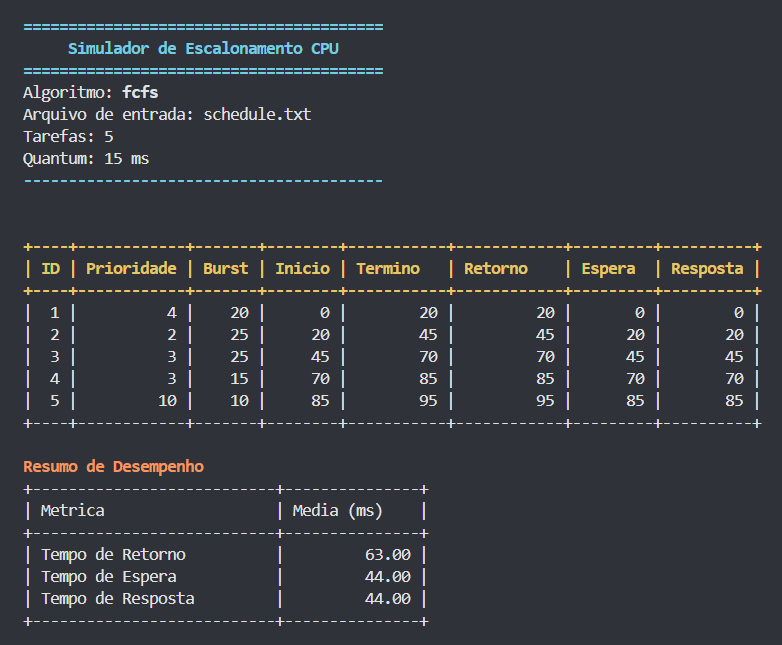

## 👥 Integrantes

| Nome | Matrícula |
| --- | --- |
| Diego de Carvalho Dias | 20230089696 |
| Luiz Augusto Brito De Albuquerque | 20230013277 |

## 📖 Descrição do Projeto

Este repositório contém a implementação do projeto final da disciplina de Sistemas Operacionais.

O **Simulador de Escalonamento de CPU** é uma ferramenta educacional que implementa e compara algoritmos clássicos de escalonamento de processos em sistemas operacionais. O projeto demonstra como diferentes estratégias de escalonamento afetam o desempenho do sistema em termos de tempo de resposta, tempo de espera e tempo de retorno.

O principal objetivo é analisar o comportamento de cinco algoritmos fundamentais:
- **FCFS (First Come, First Served)**: Escalonamento por ordem de chegada
- **SJF (Shortest Job First)**: Prioriza tarefas com menor tempo de execução
- **Priority Scheduling**: Escalonamento baseado em prioridades
- **Round Robin**: Escalonamento com quantum fixo
- **Priority Round Robin**: Combinação de prioridades com quantum

O desafio central é entender como cada algoritmo balanceia diferentes métricas de desempenho, permitindo uma análise comparativa detalhada dos compromissos entre responsividade, vazão e justiça no acesso aos recursos do processador.

## 🖼️ Interface



## 🗂️ Organização

- **Pasta `src/`**: Contém os arquivos-fonte (.cpp) e cabeçalhos (.h)
- **Pasta `build/`**: Contém os arquivos binários gerados durante a compilação
- **Arquivo `my_program`**: Executável principal
- **Arquivo `Makefile`**: Instruções para compilação e execução
- **Arquivo `schedule.txt`**: Arquivo de entrada com as tarefas a serem escalonadas

## ⚙️ Como Compilar e Executar

### Preparação

Clone o repositório e acesse a pasta do projeto:

```bash
git clone <URL_DO_REPOSITORIO>
cd SO-Projeto-Final
```

### Compilação

```bash
make
```

Isso gera o executável em `build/my_program` (ou `build/my_program.exe` no Windows).

**Para limpar os arquivos compilados:**
```bash
make clean
```

### Execução

**Opção 1: Compilar + Executar diretamente**

```bash
make
./build/my_program.exe <algoritmo>
```

**Exemplo da Opção 1:**
```bash
make
./build/my_program.exe sjf
```

**Opção 2: Usar comandos do Makefile (compila automaticamente)**

```bash
make fcfs         # Executa FCFS
make sjf          # Executa SJF
make rr           # Executa Round Robin
make priority     # Executa Escalonamento por Prioridade
make priority_rr  # Executa Round Robin com Prioridade
```

**Algoritmos disponíveis:** `fcfs`, `sjf`, `rr`, `priority`, `priority_rr`

## 💻 Instruções de Uso

1. **Edite o arquivo de entrada**: Modifique `schedule.txt` conforme necessário
2. **Compile o projeto**: Execute `make` no diretório raiz
3. **Execute um algoritmo**: Use `make <algoritmo>` ou execute diretamente
4. **Analise os resultados**: Observe a tabela por tarefa e o "Resumo de Desempenho"

### Formato do arquivo de entrada (`schedule.txt`)

Cada linha representa uma tarefa no formato:

```text
T<ID>, <prioridade>, <tempo_execucao>
```

Exemplo (já incluso no repositório):

```text
T1, 4, 20
T2, 2, 25
T3, 3, 25
T4, 3, 15
T5, 10, 10
```

**Observações:**
- O identificador `T<ID>` é ignorado pelo analisador; o simulador gera IDs internos
- Todas as tarefas têm `tempo_chegada = 0` neste simulador
- Quantum padrão: 10 ms (configurado em `src/main.cpp`)

## 📊 Avaliação de Desempenho

Para a avaliação de desempenho foram comparados os seguintes parâmetros para cada algoritmo:

- **Tempo de Retorno**: Tempo total desde a chegada até a conclusão da tarefa
- **Tempo de Espera**: Tempo que a tarefa ficou aguardando na fila de prontos
- **Tempo de Resposta**: Tempo desde a chegada até o primeiro uso da CPU

### Resultados Individuais

Métricas coletadas pelo próprio simulador (médias em ms) usando o `schedule.txt` fornecido e `quantum = 10`:

| Algoritmo     | Tempo de Retorno (média) | Tempo de Espera (média) | Tempo de Resposta (média) |
| ---           | ---:                      | ---:                     | ---:                       |
| **FCFS**      | 63.00                     | 44.00                    | 44.00                      |
| **SJF**       | 49.00                     | 30.00                    | 30.00                      |
| **Priority**  | 64.00                     | 45.00                    | 45.00                      |
| **Round Robin** | 76.00                   | 57.00                    | 20.00                      |
| **Priority RR** | 66.00                   | 47.00                    | 42.00                      |

### Análise Detalhada por Algoritmo

#### FCFS (Primeiro a Chegar, Primeiro a Ser Servido)
- **Desempenho**: Tempo de resposta igual ao tempo de espera (todas executam completamente)
- **Problemas**: Sofre com "efeito comboio" quando há tarefas longas no início

#### SJF (Menor Tarefa Primeiro)
- **Desempenho**: **Melhor** em tempo de retorno e espera (49.00ms e 30.00ms)
- **Vantagens**: Minimiza tempo médio de espera quando todos chegam simultaneamente

#### Escalonamento por Prioridade
- **Desempenho**: Comportamento intermediário, similar ao FCFS
- **Observações**: Prioriza tarefas importantes, mas pode causar starvation

#### Round Robin
- **Desempenho**: **Melhor** tempo de resposta (20.00ms), mas pior em retorno/espera
- **Vantagens**: Mais responsivo, evita starvation

#### Round Robin com Prioridade
- **Desempenho**: Balanceia responsividade com prioridades
- **Resultado**: Tempo de resposta intermediário (42.00ms)

### Comparativo Geral

| Métrica | FCFS | SJF | Prioridade | Round Robin | Prioridade RR |
|---------|------|-----|----------|-------------|-------------|
| **Melhor Retorno** | ❌ | ✅ | ❌ | ❌ | ❌ |
| **Melhor Espera** | ❌ | ✅ | ❌ | ❌ | ❌ |
| **Melhor Resposta** | ❌ | ❌ | ❌ | ✅ | ❌ |

### Observações Finais

- **SJF** é ideal para cenários onde todas as tarefas chegam simultaneamente e queremos minimizar tempo de espera
- **Round Robin** é melhor para sistemas interativos que precisam de responsividade
- **FCFS** é simples mas pode ser ineficiente com tarefas de tamanhos variados
- **Prioridade** e **Prioridade RR** são adequados quando há diferentes níveis de importância entre tarefas

## 📝 Divisão de Tarefas

| Atividade | Responsável |
|-----------|-------------|
| **1. Sistema de Leitura e Armazenamento de Tarefas** | Diego de Carvalho Dias |
| **2. Implementação dos Algoritmos de Escalonamento** | Diego de Carvalho Dias |
| **3. Implementação do Sistema de IDs Atômicos** | Luiz Augusto Brito De Albuquerque |
| **4. Análise de Desempenho e Métricas** | Luiz Augusto Brito De Albuquerque |

---